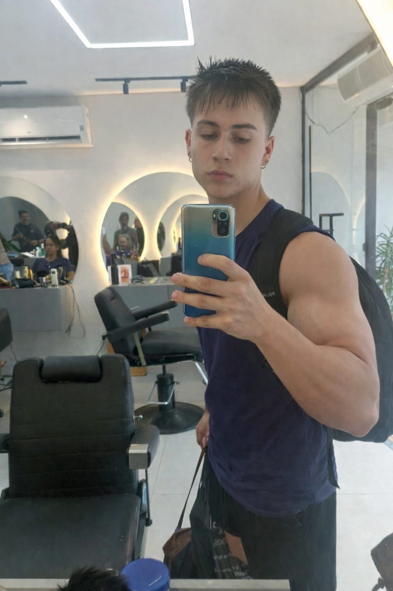

# 👻 SoulHunter — SoulUp (Sprint 03)

Plataforma sustentável gamificada, reestruturada como uma **Single Page Application (SPA)** com **React + Vite + TypeScript**, evoluindo o projeto estático (HTML, CSS e JavaScript puro) desenvolvido nas Sprints 01 e 02.

O Soul Hunter incentiva hábitos sustentáveis através de missões, pontuação e rankings, unindo gamificação, tecnologia e sustentabilidade urbana em uma experiência moderna, responsiva e totalmente componentizada — agora com uma **identidade visual noturna e sobrenatural**, fantasmas espalhados pela interface e um sistema de pontuação de verdade, que reage ao que o usuário faz, além do merge no futuro sistema de captura de fantasmas!

> **Solução do Projeto:** as páginas **Dashboard** (`/dashboard`) e **Ranking** (`/ranking`) representam a solução funcional do produto. No Dashboard, o usuário responde missões reais na "Central de Missões" e ganha pontos instantaneamente; esses pontos são refletidos ao vivo no Ranking, competindo com caçadores de referência fixos.

---

## 📸 Print da interface do site

**Ícones do sistema:** os ícones de GitHub e LinkedIn (`src/assets/img/icones/github.png` e `linkedin.png`) aparecem nos cards de Integrantes. O favicon (`public/favicon.svg`) e os fantasmas decorativos (SVG originais, componente `Ghost`) seguem a paleta noturna azul/ciano/roxo/magenta/dourado do projeto.

---

## 🎨 Identidade visual

O SoulHunter adota uma atmosfera **noturna, tecnológica e sobrenatural**:

- **Base:** tons de azul profundo (`#071a2f`, `#0b2742`, `#103a5c`) simulando um céu noturno tecnológico, com névoa em gradientes radiais.
- **Acentos:** ciano `#22d3ee` (ação/dados), verde-água `#2dd4bf` (sustentabilidade), roxo `#8b5cf6` (universo sobrenatural), magenta `#d946ef` (destaques/quiz) e dourado `#fbbf24` (conquistas/ranking).
- **Fantasmas decorativos:** componente `Ghost` (SVG próprio, com aura de brilho) espalhado via `GhostField` em todas as páginas.
- **Cor por página:** o Header e o Footer mudam de gradiente conforme a rota atual (`src/theme/pageAccent.ts`), dando a cada seção uma atmosfera própria sem perder a identidade única do SoulHunter.
- **Easter egg:** aba secreta **"Fantasma"** no menu — uma brincadeira com tela de confirmação e um grande "RAGE BAIT" cheio de fantasmas, só para descontrair. 👻

---


## 🚀 Tecnologias utilizadas

| Tecnologia | Função |
|---|---|
| [React 19](https://react.dev/) | Biblioteca de interface e componentização |
| [Vite](https://vite.dev/) | Build tool e ambiente de desenvolvimento |
| [TypeScript](https://www.typescriptlang.org/) | Tipagem estática em toda a aplicação |
| [Tailwind CSS v4](https://tailwindcss.com/) | Estilização, tema customizado e responsividade (mobile, tablet, desktop) |
| [React Router DOM](https://reactrouter.com/) | Navegação SPA, rotas estáticas e dinâmicas |
| [React Hook Form](https://react-hook-form.com/) | Formulário de contato com validação tipada |
| React Context API | Estado global de pontuação/ranking/usuário (sem bibliotecas externas) |

> Nesta Sprint **não há consumo de API** — todo o conteúdo é local/mockado, conforme especificado no desafio. O "sistema de pontos" funciona 100% em estado local do React.

---

## 📂 Estrutura de pastas

```plaintext
📦 soulhunter-react
┣ 📂 docs
┃ ┗ 📂 screenshots
┣ 📂 public
┃ ┗ 📄 favicon.svg
┣ 📂 src
┃ ┣ 📂 assets
┃ ┃ ┗ 📂 img
┃ ┃   ┣ 📂 almas
┃ ┃   ┗ 📂 icones
┃ ┣ 📂 components
┃ ┃ ┣ 📂 BackToTop
┃ ┃ ┣ 📂 Button
┃ ┃ ┣ 📂 Card
┃ ┃ ┣ 📂 ExpandableCard
┃ ┃ ┣ 📂 Footer
┃ ┃ ┣ 📂 Ghost          (fantasma SVG + campo decorativo)
┃ ┃ ┣ 📂 Header
┃ ┃ ┣ 📂 Layout
┃ ┃ ┗ 📂 ToastStack
┃ ┣ 📂 context
┃ ┃ ┗ 📄 GameContext.tsx  (pontos, usuário e ranking compartilhados)
┃ ┣ 📂 data
┃ ┃ ┣ 📄 almas.ts
┃ ┃ ┣ 📄 faq.ts           (perguntas + mini quiz)
┃ ┃ ┣ 📄 integrantes.ts
┃ ┃ ┣ 📄 missoes.ts       (perguntas do Dashboard)
┃ ┃ ┗ 📄 ranking.ts       (ranking de referência + merge dinâmico)
┃ ┣ 📂 hooks
┃ ┃ ┗ 📄 useDocumentTitle.ts
┃ ┣ 📂 pages
┃ ┃ ┣ 📂 Contato
┃ ┃ ┣ 📂 Dashboard        (+ MissionPanel.tsx)
┃ ┃ ┣ 📂 Fantasma         (easter egg / rota secreta)
┃ ┃ ┣ 📂 Faq              (+ FaqQuizBlock.tsx)
┃ ┃ ┣ 📂 Home
┃ ┃ ┣ 📂 IntegranteDetalhe (rota dinâmica)
┃ ┃ ┣ 📂 Integrantes
┃ ┃ ┣ 📂 NotFound
┃ ┃ ┣ 📂 Ranking
┃ ┃ ┗ 📂 Sobre
┃ ┣ 📂 theme
┃ ┃ ┗ 📄 pageAccent.ts    (cor de identidade por rota)
┃ ┣ 📂 types
┃ ┃ ┗ 📄 index.ts
┃ ┣ 📄 App.tsx
┃ ┣ 📄 index.css          (tema Tailwind customizado)
┃ ┗ 📄 main.tsx
┣ 📄 index.html
┣ 📄 package.json
┣ 📄 tsconfig.json
┗ 📄 vite.config.ts
```

Cada página vive em `/src/pages` e cada componente reutilizável vive em `/src/components`, seguindo o padrão `NomeDoComponente/NomeDoComponente.tsx`.

---

## 🧭 Rotas da aplicação

| Rota | Tipo | Página |
|---|---|---|
| `/` | Estática | Home |
| `/integrantes` | Estática | Integrantes |
| `/integrantes/:id` | **Dinâmica** | Detalhe do Integrante (`useParams` + `useNavigate`) |
| `/sobre` | Estática | Sobre |
| `/faq` | Estática | FAQ (com mini quiz) |
| `/contato` | Estática | Contato (React Hook Form) |
| `/dashboard` | Estática | Dashboard (Central de Missões) |
| `/ranking` | Estática | Ranking dinâmico |
| `/fantasma` | Estática | Easter egg 👻 |
| `*` | Estática | 404 - Não encontrado |

Hooks do React utilizados: `useState` (menu mobile, accordion do FAQ, expand de cards, painel de missões), `useEffect` (scroll do botão "voltar ao topo", título dinâmico do documento, toasts com auto-dismiss), `useContext` (estado global de pontuação via `GameContext`), `useNavigate` e `useParams` (navegação e leitura de parâmetros na rota dinâmica de integrantes e no easter egg).

---

## 💻 Como executar localmente

Pré-requisitos: [Node.js](https://nodejs.org/) 18+ instalado.

```bash
# 1. Clone o repositório
git clone <LINK_DO_REPOSITORIO_GITHUB>

# 2. Acesse a pasta do projeto
cd soulhunter-react

# 3. Instale as dependências
npm install

# 4. Rode o projeto em ambiente de desenvolvimento
npm run dev

# 5. Gere a build de produção (opcional)
npm run build
npm run preview
```

O projeto abrirá por padrão em `http://localhost:5173`.

**Dica para testar a gamificação:** acesse `/dashboard`, defina um nome de caçador(a) e responda algumas missões — depois vá até `/ranking` pelo menu (não recarregue a página) para ver sua pontuação refletida ao vivo na tabela.

---

## 🔗 Links

- **Repositório GitHub:** `<https://github.com/cearaa/soul_hunter_sprint3>`
- **Vídeo de apresentação (YouTube):** `<nao tem ainda>`

---

## 👨‍💻 Integrantes

| Foto | Nome | RM | Turma | GitHub | LinkedIn |
|:--:|:--|:--:|:--:|:--:|:--:|
|  | **Tárik Moussa Alma** | 571411 | 1TDSPH | [GitHub](https://github.com/cearaa) | [LinkedIn](https://www.linkedin.com/in/rikk-alma/) |
|  | **Giovanni Azevedo** | 572894 | 1TDSPH | [GitHub](https://github.com/GiovanniDEVazevedo) | [LinkedIn](https://www.linkedin.com/in/giovanni-azevedo-760753353/) |
|  | **Ítalo Neto** | 572912 | 1TDSPH | [GitHub](https://github.com/I-neeto99) | [LinkedIn](https://www.linkedin.com/in/italo-neto-390579345/) |
|  | **Fabrício Aquiles Sales da Silva** | 570985 | 1TDSPH | [GitHub](https://github.com/fabricioaquiles) | [LinkedIn](https://www.linkedin.com/in/fabricioaquiles/) |
|  | **Carlos Eduardo Tsucamoto Chiarelli** | 569574 | 1TDSPH | [GitHub](https://github.com/carlostsucamoto) | [LinkedIn](https://www.linkedin.com/in/carlostsucamoto/) |

---

## 📞 Contato

Dúvidas sobre o projeto podem ser enviadas para qualquer um dos integrantes listados acima, através do LinkedIn ou GitHub, ou pelo próprio formulário da página **Contato** da aplicação.

---

## 📌 Boas práticas aplicadas

✅ Componentização e reutilização (Header, Footer, Button, Card, ExpandableCard, Ghost, BackToTop)
✅ Tipagem estática com TypeScript em componentes, props, contexto global e formulários
✅ Navegação SPA com React Router DOM (rotas estáticas e dinâmicas)
✅ Formulário validado com React Hook Form
✅ Estilização 100% com Tailwind CSS (sem CSS externo, sem bibliotecas de UI)
✅ Responsividade completa (mobile até 480px, tablet 768px, desktop 992px+), testada em 60 combinações de rota × largura sem overflow
✅ Organização de pastas em `/src/components` e `/src/pages`
✅ Sem consumo de API e sem bibliotecas de requisição HTTP (conforme regras da Sprint 03)
✅ Identidade visual autoral e consistente, reconhecível em qualquer página do sistema
